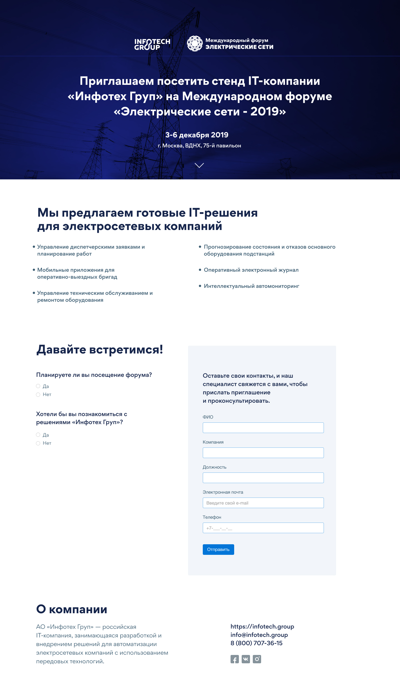

# Landing page for the event.

The purpose of developing this project was to invite partners of a particular company to the event.

The landing page was developed using the materialize library and implemented in an adaptive format. A script was also written to send applications to the required mail.

Layout was made from the layout that the designer provided from the Figma program

